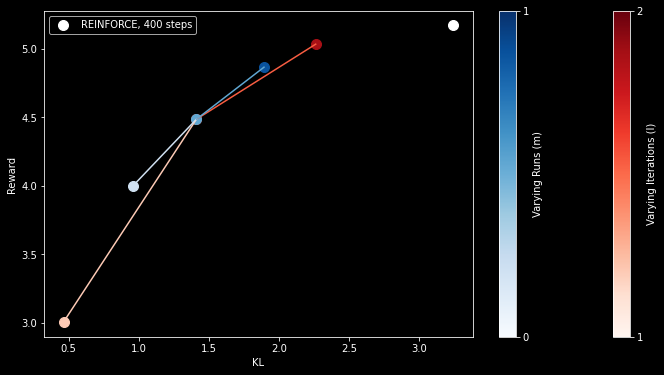

# WARP


## Введение

В задании нужно было реализовать метод alignment'а - [WARP](https://arxiv.org/abs/2406.16768). Суть метода заключается в сразу трех методиках усреднения весов: EMA для референс модели во время обучения, весов моделей, обученных на разных датасетах, а также усреднения инициализаций для последовательных запусков обучения.

Так как WARP использует RL для получения весов, которые потом усредняются (это не обязательно, см. последнюю секцию), первая стадия - обучение ревард-модели. Это стандартное обучение берта на бинарную классификацию сентимента на датасете imdb, за одну эпоху удалось получить 0.97 accuracy, что неплохо. Стандартный "lvwerra/distilbert-imdb" выдает примерно столько же, хотя и стоит отметить, что его логиты в среднем почему-то ниже, чем у получившегося у меня (~2 против ~5 для "уверенной" классификации).

Имплементация WARP из статьи учит [REINFORCE](https://arxiv.org/abs/2402.14740v1) вместо PPO на каждой итерации. В trl [заявляют](https://huggingface.co/docs/trl/v0.9.6/en/rloo_trainer) следующее:
"Note that REINFORCE / A2C is a special case of PPO, when the number of PPO epochs is 1 and the number of mini-batches is 1, which is how we implement RLOO in TRL." Немного подумав, я пришел к тому что это правда, и RLOOTrainer из trl подойдет, но все равно сделал ReinforceTrainer (reinforce_trainer.py), для читаемости) В любом случае, в него необходимо добавить обновление EMA для референсной политики, один из компонентов метода WARP.

Дальше, WARP использует 2 вложенных цикла: один усредняет через SLERP несколько моделей, полученных из разных шаффлов датасета, а второй учит несколько итераций обучения, стартующих из линейной комбинации инициализации и результата предыдущей итерации.

## Результаты

В качестве эксперимента я проварьировал гиперпараметры I и M, т.е. количество итераций обоих циклов, от 1 до 3. Результаты можно увидеть на графике ниже. На нем изображены средние реварды и средние kl-дивергенции на тестовом датасете для разных чекпоинтов. Стоит отметить, что логичным бейзлайном для метода является обычный REFINFORCE, без сложных усреднений, со схожим комптютом. Для этого я обучил REFINFORCE на 400 шагах, равных по компьюту 2*2*100 шагам WARP (стандартные гиперпараметры из задания). Этот REINFORCE тоже использует 0.99 EMA. REINFORCE показывает лучшую среднюю награду, но более высокую дивергенцию, чем WARP - по сравнению со средней точкой, т.е. той, у которой сопоставимый компьют. При этом WARP с большим компьютом (3 итерации) позволяет достичь почти такого же реварда с гораздо более низкой дивергенцией. Что касается I и M, тут тоже все логично: увеличение компьюта увеличивает реварды, но повышает KL (более длинная траектория обучения, соответственно больше возможностей уйти подальше от инициализации). При этом больше итераций позволяет достичь большего реварда, а больше ранов позволяет достичь меньшего KL, что хорошо иллюстрирует, почему нужны оба вида усреднения.



## DPO

Интересное и очевидное расширение WARP из статьи - применение его к другим методам alignment'а, так как он не нуждается ни в чем что есть только в RLHF. В частности, можно было бы применить WARP и к DPO.
Гипотеза: для DPO, WARP показывал бы еще лучшие относительные результаты (относительно просто DPO со схожим компьютом), потому что это было бы, по сути, итеративное DPO с усреднениями, а, как [известно](https://arxiv.org/abs/2404.14367), DPO выигрывает от on-policy данных.

Чтобы адаптировать WARP к DPO, нам понадобится рецепт из [SLiC](https://arxiv.org/abs/2305.10425): тоже будем обучать ревард модель, а датасет пар для DPO пересоздавать из текущей модели перед каждой итерацией (iteration, I) варпа.

Псевдокод:

```python
for iteration i from 1 to I do:
    Y = create_dataset(X, eta_curr, reward_model)
    for run m from 1 to M do:
        define eta_m, eta_ema <- eta_init
        for step t from 1 to T do:
            x, y_winner, y_loser ~ (X, Y)
            loss = dpo_loss(y_winner, y_loser, x)
# все остальное такое же
```
